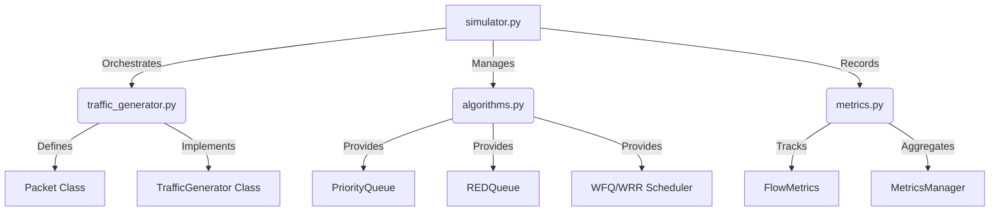

# 🛡️ QoS-Aware Packet Scheduling Simulator

This comprehensive walkthrough summarizes the implementation, modular architecture, and simulation results of the QoS-aware packet scheduling system. This project demonstrates how different queuing algorithms (PQ, WFQ, RED) handle complex, realistic traffic under 4 priority levels.

## 🏗️ Modular Architecture

The system is refactored into a "microservice-style" structure to separate concerns and improve maintainability.

## ⭐ Key Features

- **4-Level Priority System**:
    - **Highest (7)**: Network Control & Routing updates.
    - **High (5)**: Real-time services (VoIP, Video).
    - **Medium (3)**: Critical business-specific applications.
    - **Low (1)**: Best-effort traffic.
- **Realistic Traffic Generation**:
    - **Poisson Distribution**: Stochastic packet arrival modeling.
    - **Bursty Spikes**: Random spikes (10% chance) adding 2-5 extra packets to simulate data bursts.
    - **Time-Varying Load**: Dynamic rate adjustments for `best_effort` traffic to simulate periods of high/low congestion.
- **Microservice Structure**: Modularized codebase separated into `traffic_generator`, `algorithms`, and `metrics`.

## 📊 Final Simulation Results

Simulation parameters: 500 time steps, Max Queue = 20.

| Algorithm | Flow Type | Priority | Avg Delay | Throughput | Loss Rate |
| :--- | :--- | :--- | :--- | :--- | :--- |
| **PQ** | Network Control | 7 | 0.16 | 102 | 58.54% |
| | Real-time | 5 | 0.20 | 168 | 54.59% |
| | Critical Data | 3 | 1.25 | 127 | 71.65% |
| | Best-effort | 1 | 81.67 | 103 | 88.34% |
| **WFQ** | Network Control | 7 | 1.94 | 106 | 59.39% |
| | Real-time | 5 | 1.97 | 159 | 50.62% |
| | Critical Data | 3 | 14.58 | 156 | 68.07% |
| | Best-effort | 1 | 75.11 | 79 | 90.03% |
| **RED** | Network Control | 7 | 12.73 | 94 | 59.15% |
| | Real-time | 5 | 12.87 | 167 | 58.80% |
| | Critical Data | 3 | 12.64 | 137 | 72.90% |
| | Best-effort | 1 | 12.42 | 102 | 88.49% |

## 🏁 Conclusion & Insights

### 1. Priority Queuing (PQ)
**Best for**: Latency-sensitive traffic (Network Control & VoIP).
**Insight**: PQ strictly follows priority levels, ensuring the lowest possible delay for high-priority flows. However, under the heavy, bursty load implemented, it suffers from severe starvation of the `best_effort` flow, which experiences an 88% loss rate.

### 2. Weighted Fair Queuing (WFQ/WRR)
**Best for**: Balanced systems requiring fairness.
**Insight**: WFQ successfully prevented complete starvation of lower-priority flows by guaranteeing a portion of the bandwidth (weights 10:5:2:1). While delay increased slightly for high-priority flows compared to PQ, the overall system behavior was more predictable under bursty conditions.

### 3. Random Early Detection (RED)
**Best for**: Congestion avoidance in long-running flows.
**Insight**: RED levels the playing field regarding delay (~12 steps for all flows), as it is essentially a smart-drop FIFO policy. It managed to maintain a consistent delay across all types but did not differentiate service quality for high-priority traffic as effectively as PQ or WFQ.

---
**Summary for Term Project**: This simulator successfully models a complex QoS environment. The modular refactoring into separate "microservices" for traffic, algorithms, and metrics provides a scalable foundation for further network simulation research.
